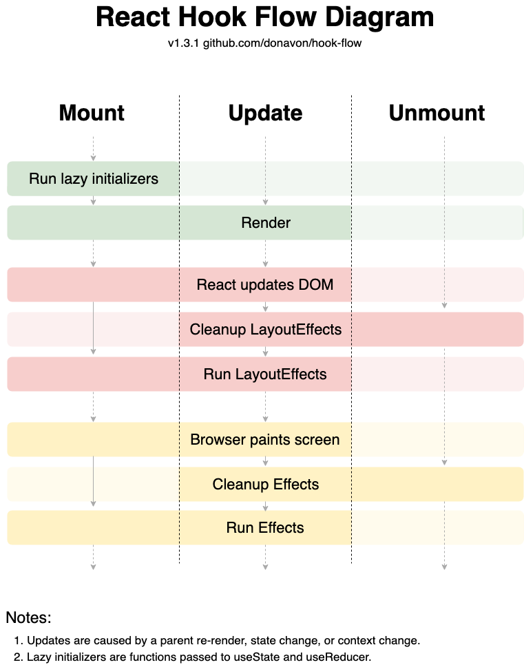

# Epic React Pro

## React Hooks

1. useState로 상태업데이트하기
2. useEffect 사용하기 , custom hooks 만들기

### 1. useState: greeting

-   01
-   01-extra-1: accept an initialName

### 2. useEffect: persistent state

-   02
-   02-extra-1: lazy state initialization
    -   ??: 왼쪽값이 `null` or `undefined`일 때 오른쪽값 return
    -   ||: 왼쪽값이 falsy value일 때 오른쪽값 return
-   02-extra-2: effect dependencies
-   02-extra-3: custom hook
    -   hooks가 포함되는 반복되는 로직을 함수에 담은 것
    -   use로 시작
-   02-extra-4: flexible localStorage hook
    -   customized serialize/deserialize를 제공할 수 있도록 해당 parameter가 추가된 듯
        ```javascript
        function useLocalStorageState(key, defaultValue = '', {serialize = JSON.stringify, deserialize = JSON.parse} = {}) { ... }
        ```
    -   default value가 함수로 제공되는 경우도 고려
        ```javascript
        return typeof defaultValue === "function" ? defaultValue() : defaultValue;
        ```
-   Hook flow
    

### 3. Lifting state

-   03
-   03-extra-1: colocating state
    -   Colocation: 어떤 코드를 가능한 한 그 코드와 가장 관련있는 장소에 두는 것
    -   Colocation은 코드의 유지보수성을 높여줄 뿐만 아니라 성능최적화와도 관련이 있음
    -   Colocating state: 어떤 state가 사용되는 가장 가까운 공통된 부모 component에 state를 위치시켜 관리하기
    -   그렇지 않으면 필요하지 않은 렌더링이 발생하므로 Component마다 `React.Memo`를 덕지덕지 발라야됨
    -   Context나 Redux를 사용할 때도 꼭 필요한 state만 root에 Provider를 적용하고 각 state에 맞는 가장 가까운 공통된 부모 component에 Provider를 적용할 것
    -   Where to put React State
        
        > [State Colocation will make your React app f1aster](https://kentcdodds.com/blog/state-colocation-will-make-your-react-app-faster)
